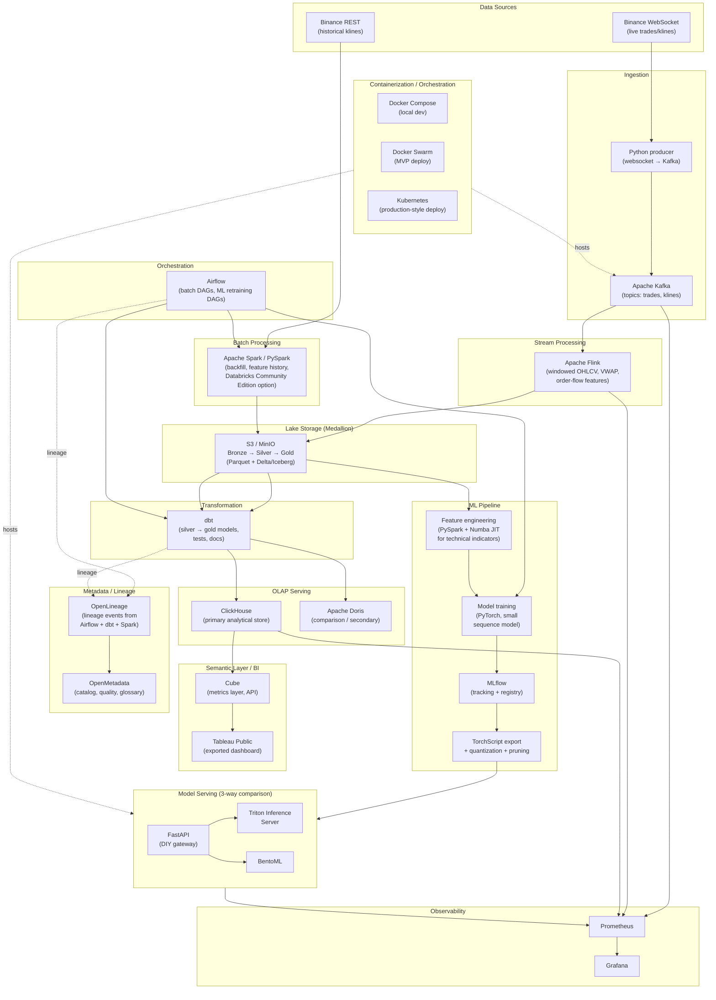

# Overall Architecture

```mermaid
flowchart TB
    subgraph SRC["Data Sources"]
        WS["Binance WebSocket\n(live trades/klines)"]
        REST["Binance REST\n(historical klines)"]
    end

    subgraph INGEST["Ingestion"]
        PROD["Python producer\n(websocket → Kafka)"]
        KAFKA["Apache Kafka\n(topics: trades, klines)"]
    end

    subgraph STREAM["Stream Processing"]
        FLINK["Apache Flink\n(windowed OHLCV, VWAP,\norder-flow features)"]
    end

    subgraph BATCH["Batch Processing"]
        SPARK["Apache Spark / PySpark\n(backfill, feature history,\nDatabricks Community Edition option)"]
    end

    subgraph LAKE["Lake Storage (Medallion)"]
        S3["S3 / MinIO\nBronze → Silver → Gold\n(Parquet + Delta/Iceberg)"]
    end

    subgraph TRANSFORM["Transformation"]
        DBT["dbt\n(silver → gold models,\ntests, docs)"]
    end

    subgraph OLAP["OLAP Serving"]
        CH["ClickHouse\n(primary analytical store)"]
        DORIS["Apache Doris\n(comparison / secondary)"]
    end

    subgraph BI["Semantic Layer / BI"]
        CUBE["Cube\n(metrics layer, API)"]
        TAB["Tableau Public\n(exported dashboard)"]
    end

    subgraph ORCH["Orchestration"]
        AF["Airflow\n(batch DAGs, ML retraining DAGs)"]
    end

    subgraph GOV["Metadata / Lineage"]
        OM["OpenMetadata\n(catalog, quality, glossary)"]
        OL["OpenLineage\n(lineage events from\nAirflow + dbt + Spark)"]
    end

    subgraph OBS["Observability"]
        PROM["Prometheus"]
        GRAF["Grafana"]
    end

    subgraph ML["ML Pipeline"]
        FEAT["Feature engineering\n(PySpark + Numba JIT\nfor technical indicators)"]
        TRAIN["Model training\n(PyTorch, small\nsequence model)"]
        MLF["MLflow\n(tracking + registry)"]
        OPT["TorchScript export\n+ quantization + pruning"]
    end

    subgraph SERVE["Model Serving (3-way comparison)"]
        TRITON["Triton Inference\nServer"]
        BENTO["BentoML"]
        FASTAPI["FastAPI\n(DIY gateway)"]
    end

    subgraph INFRA["Containerization / Orchestration"]
        DC["Docker Compose\n(local dev)"]
        SWARM["Docker Swarm\n(MVP deploy)"]
        K8S["Kubernetes\n(production-style deploy)"]
    end

    WS --> PROD --> KAFKA --> FLINK
    REST --> SPARK
    FLINK --> S3
    SPARK --> S3
    S3 --> DBT --> CH
    S3 --> DBT --> DORIS
    CH --> CUBE --> TAB
    AF --> SPARK
    AF --> DBT
    AF --> TRAIN
    AF -.lineage.-> OL --> OM
    DBT -.lineage.-> OL
    KAFKA --> PROM
    FLINK --> PROM
    CH --> PROM
    SERVE --> PROM
    PROM --> GRAF
    S3 --> FEAT --> TRAIN --> MLF --> OPT --> SERVE
    FASTAPI --> TRITON
    FASTAPI --> BENTO
    INFRA -.hosts.-> KAFKA
    INFRA -.hosts.-> SERVE
```
