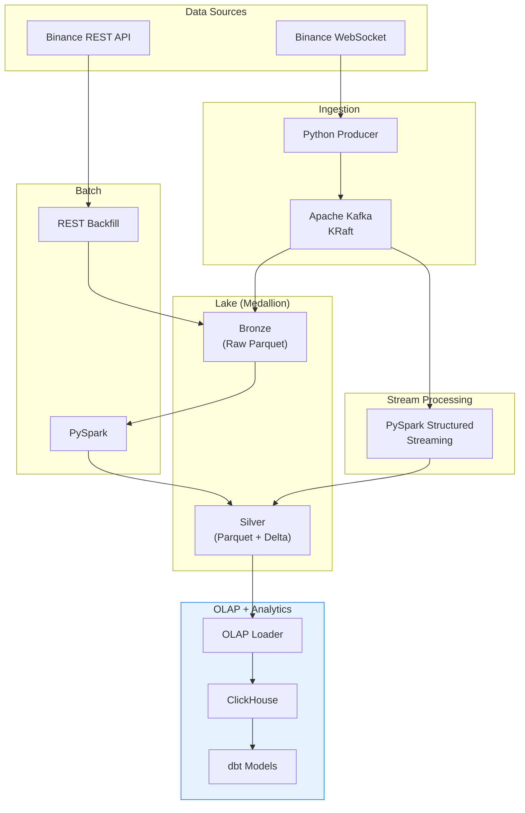

# Crypto Platform

End-to-end crypto market intelligence platform — live + historical data ingestion, lakehouse storage, OLAP analytics, and ML price-movement prediction.



## Quick Start

```bash
# 1. Clone and install
git clone https://github.com/weecici/project-x
cd project-x
uv sync

# 2. Start infrastructure
docker compose up -d

# 3. Run the live pipeline
just produce          # WS → Kafka
just write-lake       # Kafka → MinIO

# 4. Run batch pipeline
just backfill         # Historical data → bronze
just silver           # Bronze → silver transformation

# 5. Load into ClickHouse
just load-olap        # Silver → ClickHouse

# 6. Build gold tables
just dbt-deps         # Install dbt packages (sets DBT_ALLOW_EXPERIMENTAL_ADAPTERS=true)
just dbt-run          # Run all dbt models
just dbt-test         # Run dbt tests

# 7. Start streaming
just stream-ohlcv     # Kafka → OHLCV Delta + Kafka
just stream-vwap      # Kafka → VWAP Delta + Kafka

# 8. Export lineage manifest
just export-lineage   # Build OpenMetadata JSON lineage graph

# 9. ML Pipeline
just feature-eng      # Feature engineering (PySpark + Numba JIT)
just train            # Train CryptoLSTM (PyTorch + MLflow)
just optimize         # Model optimization (pruning, quantization, ONNX)

# 10. Orchestration (optional)
just airflow-init     # Initialize Airflow metadata DB
just airflow-up       # Start Airflow webserver + scheduler

# Optional profiles
# just up obs          # Start observability (Prometheus, Grafana, Loki, Alloy, AlertManager)
# just up ml           # Start MLflow tracking server
```

## Documentation

Full documentation is available at [docs/](docs/):

- [Architecture](docs/architecture/overview.md) — System design and data flow
- [Configuration](docs/guides/configuration.md) — All environment variables
- [CLI Reference](docs/reference/cli.md) — All commands
- [API Reference](docs/reference/api-utils.md) — Auto-generated from docstrings
- [dbt Models](docs/guides/dbt.md) — dbt model catalog and usage
- [Roadmap](docs/development/roadmap.md) — 10-phase build plan

## Development

```bash
# Run tests
uv run pytest tests/unit/ -v

# Lint and format
uv run ruff check src/ --fix
uv run ruff format src/

# Type check
uv run mypy src/

# Build docs locally
uv run mkdocs serve

# Just shortcuts
just pc              # Pre-commit hooks
just check           # Lint
just format          # Format
just mypy            # Type check
just docs            # Serve docs
just up              # Start infrastructure, add `ml` or `obs` to activate the corresponding profile
just down            # Stop infrastructure
just airflow-init    # Initialize Airflow database
just airflow-up      # Start the Airflow UI
```

## Tech Stack

| Layer | Technology |
|-------|-----------|
| Runtime | Python 3.13, uv |
| Streaming | Apache Kafka (KRaft), confluent-kafka, PySpark Structured Streaming |
| Batch | PySpark, httpx |
| Storage | MinIO (S3-compatible), Parquet, Delta Lake |
| OLAP | ClickHouse, clickhouse-connect |
| Semantic | Cube.js, gspread, pandas |
| Transforms | dbt, dbt-clickhouse |
| Orchestration | Apache Airflow (LocalExecutor), PostgreSQL |
| Observability | Prometheus, Grafana, Loki, Alloy, AlertManager |
| ML | PyTorch (LSTM), MLflow, Numba JIT, ONNX, pandas-ta |
| Validation | Pydantic v2 |
| Infrastructure | Docker Compose |
| Testing | pytest, testcontainers |
| Linting | ruff, mypy --strict |

## License

MIT
