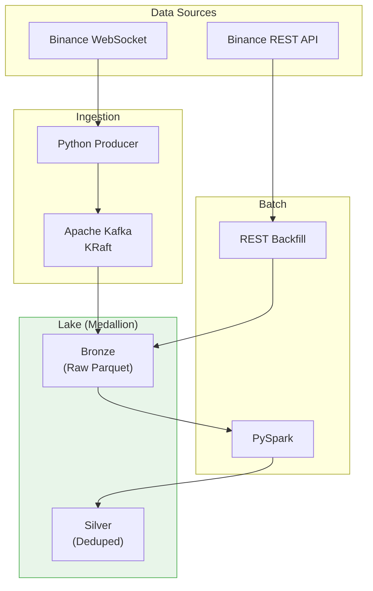

# Crypto Platform

End-to-end crypto market intelligence platform — live + historical data ingestion, lakehouse storage, OLAP analytics, and ML price-movement prediction.



## Quick Start

```bash
# 1. Clone and install
git clone https://github.com/yourusername/crypto-platform.git
cd crypto-platform
uv sync

# 2. Start infrastructure
docker compose up -d

# 3. Run the live pipeline
uv run produce        # Terminal 1: WS → Kafka
uv run write-lake     # Terminal 2: Kafka → MinIO

# 4. Run batch pipeline
uv run backfill       # Historical data → bronze
uv run silver         # Bronze → silver transformation
```

## Tech Stack

| Layer | Technology |
|-------|-----------|
| Runtime | Python 3.13, uv |
| Streaming | Apache Kafka (KRaft), confluent-kafka |
| Batch | PySpark, httpx |
| Storage | MinIO (S3-compatible), Parquet |
| Validation | Pydantic v2 |
| Infrastructure | Docker Compose |
| Testing | pytest, testcontainers |
| Linting | ruff, mypy --strict |

## Project Structure

```
src/
├── utils/           # Shared utilities (logging, retry, storage)
├── ingestion/       # Live WS → Kafka → MinIO pipeline
└── batch/           # REST backfill + PySpark silver transformer
tests/
├── unit/            # Fast, no Docker
├── integration/     # Docker required (testcontainers)
└── e2e/             # Full stack
```

## Documentation

Full documentation is available at [docs/](docs/):

- [Architecture](docs/architecture/overview.md) — System design and data flow
- [Configuration](docs/guides/configuration.md) — All environment variables
- [CLI Reference](docs/reference/cli.md) — All commands
- [API Reference](docs/reference/api-utils.md) — Auto-generated from docstrings
- [Roadmap](docs/development/roadmap.md) — 10-phase build plan

## Development

```bash
# Run tests
uv run pytest tests/unit/ -v

# Lint and format
uv run ruff check src/ --fix
uv run ruff format src/

# Type check
uv run mypy src/

# Build docs locally
uv run mkdocs serve
```

## Current Status

| Phase | Name | Status |
|:-----:|------|:------:|
| 1 | Foundation + Ingestion | Done |
| 2 | Batch + Lake Maturation | Done |
| 3 | OLAP + dbt | Planned |
| 4 | Stream Processing | Planned |
| 5 | Semantic Layer + BI | Planned |
| 6 | Orchestration + Governance | Planned |
| 7 | Observability | Planned |
| 8 | ML Pipeline | Planned |
| 9 | ML Serving | Planned |
| 10 | CI/CD + Deploy | Planned |

## License

MIT
