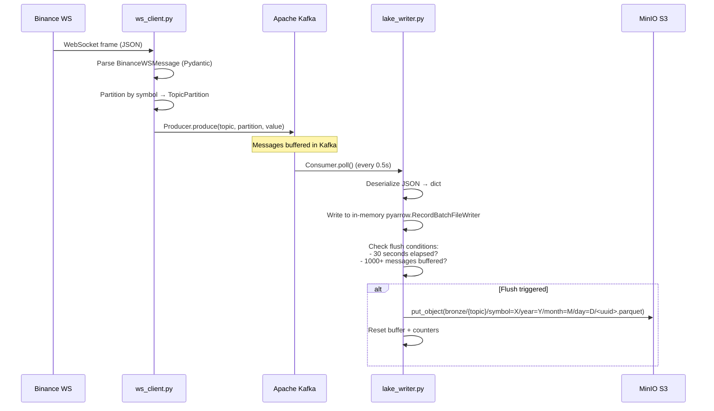
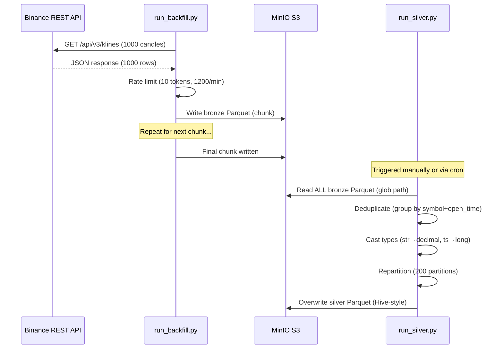
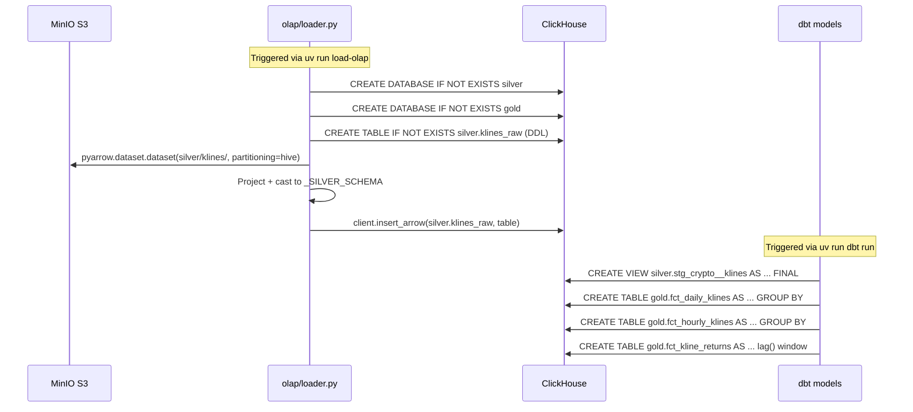
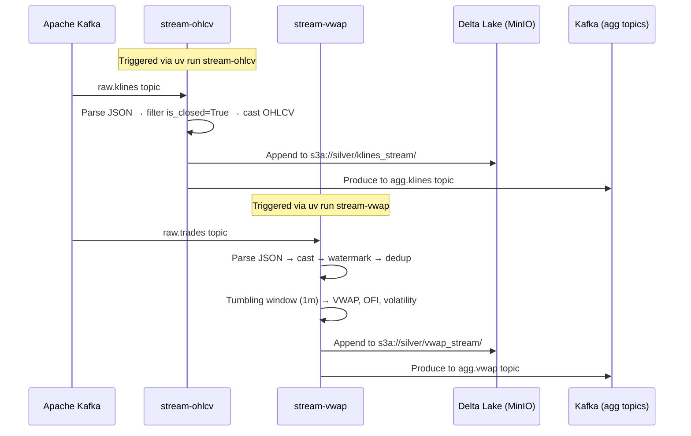

# Data Flow

Trace the complete journey of data from Binance through every layer of the platform.

## Live Pipeline (Phase 1)



### Live Pipeline Details

1. **WebSocket Client** (`ws_client.py`)
   - Connects to `wss://stream.binance.com:9443/ws/`
   - Subscribes to multiple streams in one connection (`<symbol>@trade`, `<symbol>@kline_<interval>`)
   - Each incoming message is parsed through a discriminated union (`Trade | Kline`)
   - Messages are partitioned by symbol and sent to the correct Kafka partition
   - Graceful shutdown via `signal.signal(SIGINT)`

2. **Kafka Broker**
   - Topics: `raw.trades`, `raw.klines`
   - KRaft mode (no ZooKeeper dependency)
   - Partitions: Configurable per topic
   - Messages retained for 7 days (configurable)

3. **Lake Writer** (`lake_writer.py`)
   - Polls Kafka every 0.5s (configurable)
   - Buffers messages in memory
   - Flushes to MinIO when either condition is met:
     - 30 seconds since last flush (configurable)
     - 1,000+ messages buffered (configurable)
   - Each flush creates a new Parquet file with a UUID filename
   - Files are written to Hive-partitioned paths

## Batch Pipeline (Phase 2)



### Batch Pipeline Details

1. **REST Backfiller** (`binance_rest.py`)
   - Uses `httpx.AsyncClient` with connection pooling (100 max connections)
   - Rate limited: 10 tokens per request, 1200 tokens/minute
   - Splits large backfills into 7-day chunks (configurable)
   - Each chunk is written as a separate Parquet file
   - Retry with exponential backoff (up to 3 attempts per chunk)
   - Results aggregated into `BackfillResult`

2. **Silver Transformer** (`kline_transformer.py`)
   - PySpark job running in local mode (`local[*]`)
   - **Read**: Globs all `silver/klines/**/*.parquet` from MinIO
   - **Deduplicate**: `dropDuplicates(["symbol", "open_time"])`
   - **Cast**: Ensures correct types (decimals, longs)
   - **Repartition**: 200 partitions for write parallelism
   - **Write**: Overwrites `silver/klines/` with cleaned data
   - Reports `SilverResult` with input/output/duplicate counts

## OLAP Pipeline (Phase 3)



### OLAP Pipeline Details

1. **OLAP Loader** (`loader.py`)
   - Creates `silver` and `gold` databases if they don't exist
   - Runs `KLINES_RAW_DDL` to create `silver.klines_raw` table
   - Reads Hive-partitioned Parquet directly from MinIO via `pyarrow.dataset`
   - Projects and casts columns to match `_SILVER_SCHEMA`
   - Inserts via `clickhouse-connect` `insert_arrow()` (zero-copy columnar path)
   - `ReplacingMergeTree(_loaded_at)` ensures idempotent re-loads

2. **dbt Models**
   - **Staging** (`stg_crypto__klines`): View on `silver.klines_raw` with `FINAL` keyword for dedup, surrogate keys via `dbt_utils.generate_surrogate_key`
   - **Marts**: Aggregated tables in `gold` database
     - `fct_daily_klines`: Daily OHLCV from 1m bars (`argMin`/`argMax` for open/close)
     - `fct_hourly_klines`: Hourly OHLCV (same logic, hourly grouping)
     - `fct_kline_returns`: Log returns via `lag()` window function

## Streaming Pipeline (Phase 4)



### Streaming Pipeline Details

1. **OHLCV Stream** (`ohlcv_stream.py`)
   - Reads from `raw.klines` Kafka topic
   - Parses JSON against inline schema (kline nested structure)
   - Filters only closed bars (`is_closed == True`)
   - Casts OHLCV fields to `DecimalType(18,8)`
   - **Dual-sink**: Appends to Delta Lake + produces to `agg.klines` Kafka topic
   - Checkpoint-based exactly-once semantics

2. **VWAP Stream** (`vwap_stream.py`)
   - Reads from `raw.trades` Kafka topic
   - Parses JSON, casts price/quantity to `DoubleType`
   - Applies event-time watermark on `trade_time`
   - Deduplicates within watermark (`dropDuplicatesWithinWatermark`)
   - Tumbling window aggregation (1 minute default)
   - Computes:
     - **VWAP**: `sum(price * quantity) / sum(quantity)`
     - **Order Flow Imbalance**: Net taker buy/sell pressure
     - **Price Volatility**: `stddev_samp(price)`
     - **Trade Count**: `count(*)`
   - **Dual-sink**: Appends to Delta Lake + produces to `agg.vwap` Kafka topic

### Key Differences: Batch vs Streaming Silver

| Aspect | Batch (PySpark) | Streaming (Structured Streaming) |
|--------|-----------------|-----------------------------------|
| Input | Bronze Parquet (glob) | Kafka topics (real-time) |
| Output | Silver Parquet (Hive) | Delta Lake + Kafka |
| Dedup | `dropDuplicates` (full scan) | `dropDuplicatesWithinWatermark` (stateful) |
| Latency | Minutes (batch) | Seconds (micro-batch) |
| Trigger | Manual/cron | Continuous |
| Checkpoint | None | S3-based checkpoints |

## Data Lineage

```
Binance WebSocket
  └→ ws_client.py
       └→ Kafka (raw.trades, raw.klines)
            └→ lake_writer.py
                 └→ MinIO bronze/trades/<uuid>.parquet
                 └→ MinIO bronze/klines/<uuid>.parquet

Binance REST API
  └→ binance_rest.py (run_backfill.py)
       └→ MinIO bronze/klines/<uuid>.parquet

MinIO bronze/
  └→ kline_transformer.py (run_silver.py)
       └→ MinIO silver/klines/<uuid>.parquet

MinIO silver/
  └→ olap/loader.py (run_loader.py)
       └→ ClickHouse silver.klines_raw

ClickHouse silver/
  └→ dbt (stg_crypto__klines view)
       └→ gold.fct_daily_klines
       └→ gold.fct_hourly_klines
       └→ gold.fct_kline_returns
```

## File Naming

All Parquet files use UUID-based filenames to prevent duplicate writes:

```
{uuid}.parquet          # e.g., a1b2c3d4-e5f6-7890-abcd-ef1234567890.parquet
```

The `lake_writer.py` checks if a file with the same UUID already exists before writing — if it does, the write is skipped (idempotent).

## Flush Behavior

The lake writer uses a dual-trigger flush mechanism:

| Trigger | Default | Configurable |
|---------|---------|--------------|
| Time-based | 30 seconds | `INGESTION_FLUSH_INTERVAL_SECONDS` |
| Size-based | 1,000 messages | `INGESTION_FLUSH_THRESHOLD` |
| Shutdown | On SIGINT/SIGTERM | Automatic |

On shutdown, remaining messages are flushed immediately (no data loss).
