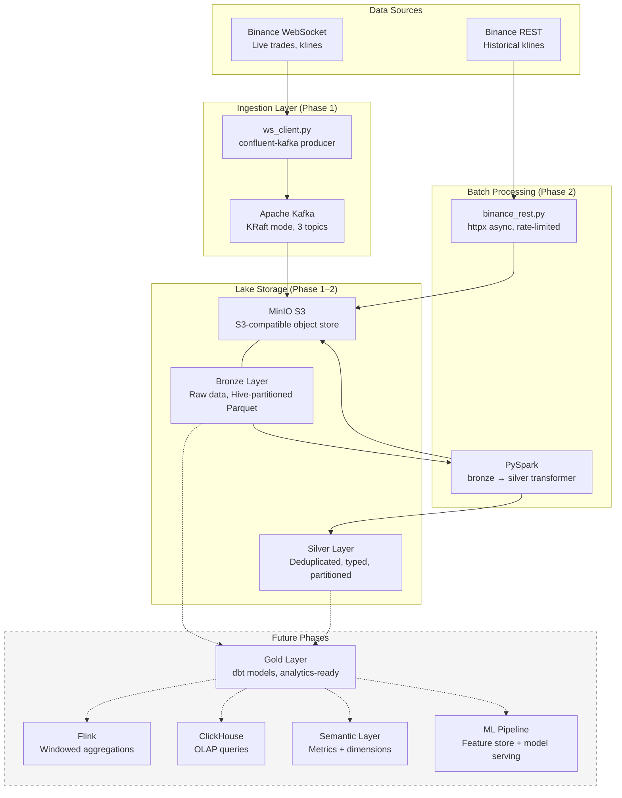

# Architecture Overview

The Crypto Platform follows a **Medallion Architecture** (Bronze → Silver → Gold) with a hybrid streaming + batch design.

## High-Level Architecture

## Medallion Architecture

The platform organizes data in three tiers:

| Layer | Format | Purpose | Partitioning |
|-------|--------|---------|--------------|
| **Bronze** | Parquet | Raw data exactly as received | `symbol/`, `topic/`, `year/`, `month/`, `day/` |
| **Silver** | Parquet | Deduplicated, typed, cleaned | `symbol/`, `interval/`, `year/`, `month/` |
| **Gold** | Parquet/SQL | Aggregated, analytics-ready | TBD (Phase 3) |

### Bronze Layer

- Written directly from the Kafka consumer and REST backfiller
- **No transformations** — data is preserved exactly as received
- Each message gets a UUID (`message_id`), Kafka offset tracking, and ingestion timestamp
- Files flushed every 30 seconds or 1,000 messages (whichever comes first)
- UUID-based filenames prevent duplicate writes on retry

### Silver Layer

- Written by PySpark batch jobs reading from bronze
- **Deduplication** by `symbol + open_time` (klines) or `symbol + trade_id` (trades)
- Type casting (strings → decimals, timestamps → longs)
- Partitioned by `symbol/interval/year/month` for optimal query patterns
- Overwrites partitions atomically

### Gold Layer (Planned)

- dbt models consuming silver data
- Pre-computed aggregations, technical indicators, feature tables
- Query-optimized materialized views for OLAP and ML

## Design Principles

1. **Append-only lake** — No in-place mutations. All writes are new Parquet files.
2. **Idempotent writes** — UUID-based dedup means re-running a job produces the same result.
3. **Schema evolution** — Parquet + PySpark handles schema changes gracefully.
4. **Decoupled components** — Kafka decouples producers from consumers. Each component can be restarted independently.
5. **Local-first development** — Everything runs on a single machine with Docker. No cloud dependencies for development.

## Component Map

| Component | Technology | Location | Purpose |
|-----------|-----------|----------|---------|
| WebSocket client | `confluent-kafka` + `websockets` | `src/ingestion/ws_client.py` | Live Binance data stream |
| Kafka producer | `confluent-kafka` | `src/ingestion/ws_client.py` | Publish to Kafka topics |
| Lake writer | `confluent-kafka` + `pyarrow` | `src/ingestion/lake_writer.py` | Kafka → bronze Parquet |
| REST backfiller | `httpx` + `pyarrow` | `src/batch/binance_rest.py` | Historical data → bronze |
| Silver transformer | PySpark | `src/batch/kline_transformer.py` | Bronze → silver dedup |
| Config | Pydantic v2 | `src/ingestion/config.py`, `src/batch/config.py` | Typed, validated settings |
| Shared utils | Various | `src/utils/` | Logging, retry, S3 access |

## Infrastructure

| Service | Port | Purpose |
|---------|------|---------|
| Apache Kafka | 9094 | Message broker (KRaft mode, no ZooKeeper) |
| Kafka UI | 8080 | Web UI for topic inspection |
| MinIO API | 9000 | S3-compatible object storage API |
| MinIO Console | 9001 | Web UI for bucket browsing |
