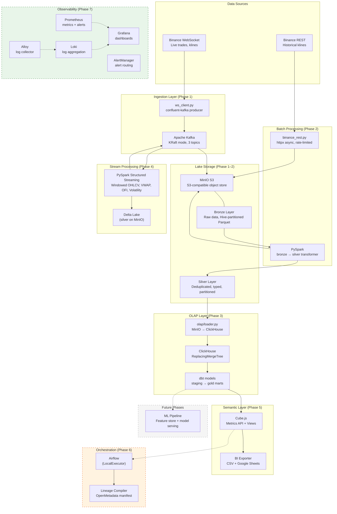

# Architecture Overview

The Crypto Platform follows a **Medallion Architecture** (Bronze → Silver → Gold) with a hybrid streaming + batch design and OLAP analytics via ClickHouse.

## High-Level Architecture

## Medallion Architecture

The platform organizes data in three tiers:

| Layer | Format | Purpose | Partitioning |
|-------|--------|---------|--------------|
| **Bronze** | Parquet | Raw data exactly as received | `symbol/`, `topic/`, `year/`, `month/`, `day/` |
| **Silver** | Parquet + ClickHouse | Deduplicated, typed, cleaned | `symbol/`, `interval/`, `year/`, `month/` |
| **Gold** | ClickHouse tables | Aggregated, analytics-ready | `symbol/`, `trade_date` / `hour_at` |

### Bronze Layer

- Written directly from the Kafka consumer and REST backfiller
- **No transformations** — data is preserved exactly as received
- Each message gets a UUID (`message_id`), Kafka offset tracking, and ingestion timestamp
- Files flushed every 30 seconds or 1,000 messages (whichever comes first)
- UUID-based filenames prevent duplicate writes on retry

### Silver Layer

- **Parquet (batch)**: Written by PySpark batch jobs reading from bronze
  - **Deduplication** by `symbol + open_time` (klines) or `symbol + trade_id` (trades)
  - Type casting (strings → decimals, timestamps → longs)
  - Partitioned by `symbol/interval/year/month` for optimal query patterns
  - Overwrites partitions atomically
- **Delta Lake (streaming)**: Written by PySpark Structured Streaming
  - OHLCV: filter closed klines, cast to Silver types, append to Delta
  - VWAP: event-time tumbling windows with watermarking (VWAP, OFI, volatility, trade count)
  - Stateful deduplication within watermark
  - Checkpoint-based exactly-once semantics
- **ClickHouse**: Loaded by `olap/loader.py` from MinIO silver Parquet
  - `ReplacingMergeTree(_loaded_at)` engine for idempotent loads
  - Partitioned by `(symbol, toYYYYMM(open_time))`
  - Ordered by `(symbol, interval, open_time)`

### Gold Layer (Phase 3)

- dbt models consuming ClickHouse silver data
- **Staging**: `stg_crypto__klines` — typed view with surrogate keys
- **Marts**:
  - `fct_daily_klines` — daily OHLCV aggregates
  - `fct_hourly_klines` — hourly OHLCV aggregates
  - `fct_kline_returns` — log returns per bar
- Query-optimized tables for OLAP and downstream consumption

## Design Principles

1. **Append-only lake** — No in-place mutations. All writes are new Parquet files.
2. **Idempotent writes** — UUID-based dedup means re-running a job produces the same result.
3. **Schema evolution** — Parquet + PySpark handles schema changes gracefully.
4. **Decoupled components** — Kafka decouples producers from consumers. Each component can be restarted independently.
5. **Local-first development** — Everything runs on a single machine with Docker. No cloud dependencies for development.
6. **Medallion consistency** — Bronze → Silver → Gold naming maps directly to MinIO buckets and ClickHouse databases.

## Component Map

| Component | Technology | Location | Purpose |
|-----------|-----------|----------|---------|
| WebSocket client | `confluent-kafka` + `websockets` | `src/ingestion/producer/ws_client.py` | Live Binance data stream |
| Kafka producer | `confluent-kafka` | `src/ingestion/producer/ws_client.py` | Publish to Kafka topics |
| Lake writer | `confluent-kafka` + `pyarrow` | `src/ingestion/writer/lake_writer.py` | Kafka → bronze Parquet |
| REST backfiller | `httpx` + `pyarrow` | `src/batch/backfill/binance_rest.py` | Historical data → bronze |
| Silver transformer | PySpark | `src/batch/silver/kline_transformer.py` | Bronze → silver dedup |
| Stream processor | PySpark | `src/streaming/` | Real-time aggregates → silver Delta Lake |
| OLAP loader | `clickhouse-connect` + `pyarrow` | `src/olap/loader.py` | MinIO silver → ClickHouse |
| BI exporter | Cube.js REST + `gspread` | `src/olap/exporter.py` | Cube → CSV + Google Sheets |
| dbt models | `dbt-clickhouse` | `dbt/models/` | Silver → gold SQL transforms |
| Cube.js | Cube.js | `cube/` | Semantic layer (metrics + views) |
| Airflow | Apache Airflow | `src/orchestration/dags/` | Workflow orchestration |
| Lineage compiler | OpenLineage | `src/orchestration/governance/` | Data lineage manifest |
| Prometheus | `prom/prometheus` | `infra/observability/prometheus/` | Metrics collection + alerting |
| Grafana | `grafana/grafana` | `infra/observability/grafana/` | Dashboards (infra, host, ML stub) |
| Loki | `grafana/loki` | `infra/observability/loki/` | Log aggregation (7-day retention) |
| Alloy | `grafana/alloy` | `infra/observability/alloy/` | Docker log collector |
| AlertManager | `prom/alertmanager` | `infra/observability/alertmanager/` | Alert routing |
| Config | Pydantic v2 | `src/*/config.py` | Typed, validated settings |
| Shared utils | Various | `src/utils/` | Logging, retry, S3 access |

## Infrastructure

| Service | Port | Purpose |
|---------|------|---------|
| Apache Kafka | 9094 | Message broker (KRaft mode, no ZooKeeper) |
| Kafka UI | 8080 | Web UI for topic inspection |
| MinIO API | 9000 | S3-compatible object storage API |
| MinIO Console | 9001 | Web UI for bucket browsing |
| ClickHouse HTTP | 8123 | ClickHouse HTTP interface (OLAP queries, dbt) |
| ClickHouse TCP | 9009 | ClickHouse native TCP (internal replication) |
| ClickHouse Prometheus | 9363 | ClickHouse native metrics endpoint |
| Airflow | 8085 | Airflow webserver (LocalExecutor) |
| PostgreSQL | 5432 | Airflow metadata database |
| Prometheus | 9090 | Metrics collection + TSDB |
| Grafana | 3000 | Dashboards + alerting UI |
| Loki | 3100 | Log aggregation (7-day retention) |
| AlertManager | 9093 | Alert routing + deduplication |
| kafka-exporter | 9308 | Kafka consumer lag metrics |
| cAdvisor | 8083 | Per-container metrics |
| node-exporter | 9100 | Host hardware metrics |
| statsd-exporter | 9102 | Airflow StatsD → Prometheus bridge |
| Alloy | 12345 | Docker log collection |
