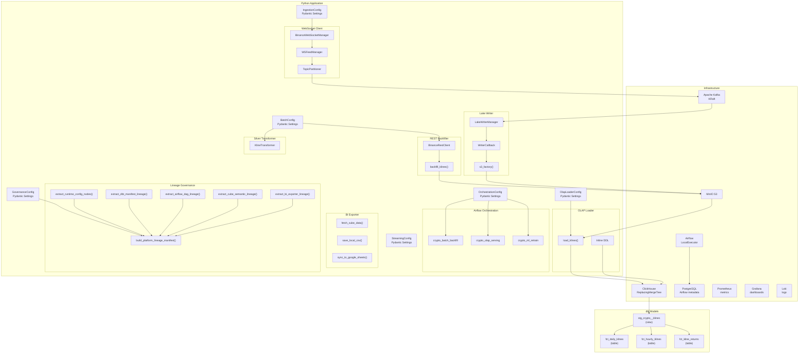

# System Design

Detailed breakdown of each system component, including data models, configuration, and inter-component communication.

## Component Architecture



## Source Layout

```
src/
├── __init__.py
├── utils/                          # Shared cross-phase utilities
│   ├── __init__.py
│   ├── logging.py                  # Structured JSON + console logging
│   ├── retry.py                    # @async_retry decorator (exponential backoff)
│   ├── storage.py                  # s3_factory() → minio.MinIO
│   └── spark.py                    # build_spark_session() shared SparkSession
├── ingestion/                      # Phase 1: Live data pipeline
│   ├── __init__.py
│   ├── config.py                   # IngestionConfig (Pydantic Settings)
│   ├── models.py                   # BinanceWSMessage, Trade, Kline
│   ├── run_producer.py             # Entry point: produce command
│   ├── run_lake_writer.py          # Entry point: write-lake command
│   ├── producer/
│   │   ├── __init__.py
│   │   └── ws_client.py            # WebSocket → Kafka producer
│   └── writer/
│       ├── __init__.py
│       └── lake_writer.py          # Kafka consumer → MinIO bronze writer
├── batch/                          # Phase 2: Batch processing
│   ├── __init__.py
│   ├── config.py                   # BatchConfig (Pydantic Settings)
│   ├── models.py                   # BackfillConfig, BackfillResult, SilverResult
│   ├── run_backfill.py             # Entry point: backfill command
│   ├── run_silver.py               # Entry point: silver command
│   ├── backfill/
│   │   ├── __init__.py
│   │   └── binance_rest.py         # httpx async REST client + backfill
│   └── silver/
│       ├── __init__.py
│       └── kline_transformer.py    # PySpark bronze → silver transformer
├── olap/                           # Phase 3+5: OLAP loading + BI export
│   ├── __init__.py
│   ├── config.py                   # OlapLoaderConfig, BiExporterConfig (Pydantic Settings)
│   ├── loader.py                   # MinIO silver → ClickHouse loader (DDL inlined)
│   └── exporter.py                 # Cube REST API → CSV + Google Sheets
├── streaming/                      # Phase 4: Stream processing
│   ├── __init__.py
│   ├── config.py                   # StreamingConfig (Pydantic Settings)
│   ├── run_ohlcv.py                # Entry point: stream-ohlcv command
│   ├── run_vwap.py                 # Entry point: stream-vwap command
│   └── jobs/
│       ├── __init__.py
│       ├── ohlcv_stream.py         # Kline OHLCV streaming job
│       └── vwap_stream.py          # VWAP + microstructure metrics job
├── ml/                             # Phase 8: ML pipeline
│   ├── __init__.py
│   ├── features/
│   │   ├── __init__.py
│   │   ├── config.py               # FeatureConfig (Pydantic Settings)
│   │   ├── dataset.py              # PyTorch CryptoDataset
│   │   ├── numba_indicators.py     # Numba JIT EMA, RSI, MACD indicators
│   │   ├── run_feature_eng.py      # Entry point: feature-eng command
│   │   └── spark_features.py       # PySpark batch feature pipeline
│   ├── training/
│   │   ├── __init__.py
│   │   ├── config.py               # TrainingConfig (Pydantic Settings)
│   │   ├── model.py                # CryptoLSTM architecture
│   │   ├── run_train.py            # Entry point: train-model command
│   │   └── trainer.py              # MLflow-tracked training loop
│   └── optimization/
│       ├── __init__.py
│       ├── benchmark.py            # ModelBenchmark + OptimizationResult
│       ├── compile_model.py        # torch.compile wrapper
│       ├── config.py               # OptimizationConfig (Pydantic Settings)
│       ├── prune_model.py          # Structured pruning
│       ├── quantize_model.py       # Dynamic INT8 quantization
│       └── run_optimize.py         # Entry point: optimize-model command
└── orchestration/                  # Phase 6: Workflow orchestration + governance
    ├── __init__.py
    ├── config.py                   # OrchestrationConfig, GovernanceConfig (Pydantic Settings)
    ├── dags/
    │   ├── __init__.py
    │   ├── crypto_batch_backfill_dag.py   # Parallel per-symbol backfill DAG
    │   ├── crypto_olap_serving_dag.py     # ClickHouse → dbt → BI + lineage DAG
    │   └── crypto_ml_retrain_dag.py       # ML retrain trigger (placeholder)
    └── governance/
        ├── __init__.py
        ├── lineage.py              # Lineage Manifest Compiler (5-source extraction)
        └── run_lineage.py          # Entry point: export-lineage command
```

## Data Models

### Ingestion Models (`src/ingestion/models.py`)

All models use Pydantic v2 with `model_config = ConfigDict(populate_by_name=True)`.

#### BinanceWSMessage (Union Type)

```python
BinanceWSMessage = Annotated[
    Trade | Kline,
    Field(discriminator="type")  # Discriminated on 'type' field
]
```

#### Trade

| Field | Type | Description |
|-------|------|-------------|
| `type` | `Literal["trade"]` | Always `"trade"` |
| `symbol` | `str` | Trading pair (e.g., `BTCUSDT`) |
| `trade_id` | `int` | Binance trade ID |
| `price` | `str` | Price as string (preserves precision) |
| `quantity` | `str` | Quantity as string |
| `trade_time` | `int` | Unix timestamp in milliseconds |
| `is_buyer_maker` | `bool` | Whether buyer is the maker |
| `event_time` | `int` | Event time in milliseconds |

#### Kline

| Field | Type | Description |
|-------|------|-------------|
| `type` | `Literal["kline"]` | Always `"kline"` |
| `symbol` | `str` | Trading pair |
| `interval` | `str` | Kline interval (`1m`, `5m`, `1h`, etc.) |
| `open_time` | `int` | Open time in milliseconds |
| `close_time` | `int` | Close time in milliseconds |
| `open` | `str` | Open price |
| `high` | `str` | High price |
| `low` | `str` | Low price |
| `close` | `str` | Close price |
| `volume` | `str` | Base asset volume |
| `quote_volume` | `str` | Quote asset volume |
| `trades_count` | `int` | Number of trades |
| `is_closed` | `bool` | Whether this kline is closed |

### Batch Models (`src/batch/models.py`)

#### BackfillConfig

| Field | Type | Default | Description |
|-------|------|---------|-------------|
| `symbol` | `str` | — | Trading pair |
| `interval` | `str` | — | Kline interval |
| `start_time` | `datetime` | — | Backfill start (inclusive) |
| `end_time` | `datetime | None` | `None` | Backfill end (inclusive), None = latest |
| `limit` | `int` | `1000` | Max candles per request |
| `max_retries` | `int` | `3` | Retry count per chunk |
| `chunk_days` | `int` | `7` | Days per chunk for splitting |

#### BackfillResult

| Field | Type | Description |
|-------|------|-------------|
| `total_chunks` | `int` | Total chunks attempted |
| `success` | `int` | Successful chunks |
| `failed` | `int` | Failed chunks |
| `total_rows` | `int` | Total rows written |
| `errors` | `list[dict]` | Error details per failed chunk |

#### SilverResult

| Field | Type | Description |
|-------|------|-------------|
| `input_rows` | `int` | Rows read from bronze |
| `output_rows` | `int` | Rows written to silver |
| `duplicate_rows` | `int` | Duplicates removed |
| `execution_time_seconds` | `float` | Total execution time |
| `errors` | `list[str]` | Error messages |

### OLAP Config (`src/olap/config.py`)

#### OlapLoaderConfig

`OlapConfig` is an alias for `OlapLoaderConfig`.

| Field | Type | Default | Description |
|-------|------|---------|-------------|
| `clickhouse_host` | `str` | `"localhost"` | ClickHouse host |
| `clickhouse_port` | `int` | `8123` | HTTP interface port |
| `clickhouse_db` | `str` | `"crypto"` | Target database |
| `clickhouse_user` | `str` | `"default"` | ClickHouse user |
| `clickhouse_password` | `str` | `""` | ClickHouse password |
| `clickhouse_table_klines` | `str` | `"klines_raw"` | Target table for kline data |
| `minio_endpoint` | `str` | `"http://localhost:9000"` | MinIO endpoint |
| `minio_access_key` | `str` | `"minioadmin"` | MinIO access key |
| `minio_secret_key` | `str` | `"minioadmin"` | MinIO secret key |
| `minio_bucket_silver` | `str` | `"silver"` | Silver bucket name |
| `silver_klines_prefix` | `str` | `"klines/"` | S3 prefix for kline Parquet |

#### BiExporterConfig

| Field | Type | Default | Description |
|-------|------|---------|-------------|
| `cube_api_url` | `str` | `"http://localhost:4000"` | Cube.js REST API endpoint |
| `cube_api_secret` | `str` | `""` | Cube.js API secret for authentication |
| `output_dir` | `Path` | `".exports"` | Local CSV output directory |
| `google_service_account_file` | `Path \| None` | `None` | Path to Google service account JSON |
| `google_sheet_name` | `str` | `""` | Target Google Sheets spreadsheet name |

### Orchestration Config (`src/orchestration/config.py`)

#### OrchestrationConfig

| Field | Type | Default | Description |
|-------|------|---------|-------------|
| `airflow_url` | `str` | `"http://localhost:8085"` | Airflow webserver URL |
| `airflow_user` | `str` | `"airflow"` | Airflow username |
| `airflow_password` | `str` | `"airflow"` | Airflow password |
| `airflow_dags_folder` | `Path` | `"src/orchestration/dags"` | DAG definitions directory |

#### GovernanceConfig

| Field | Type | Default | Description |
|-------|------|---------|-------------|
| `openlineage_url` | `str` | `"http://localhost:8585/api/v1/openlineage"` | OpenLineage API endpoint |
| `openlineage_namespace` | `str` | `"crypto-platform"` | OpenLineage namespace identifier |
| `openmetadata_url` | `str` | `"http://localhost:8585"` | OpenMetadata API endpoint |
| `lineage_output_dir` | `Path` | `".exports"` | Output directory for lineage manifest JSON |

### Streaming Config (`src/streaming/config.py`)

#### StreamingConfig

| Field | Type | Default | Description |
|-------|------|---------|-------------|
| `kafka_bootstrap_servers` | `str` | `"localhost:9094"` | Kafka broker address |
| `kafka_topic_trades` | `str` | `"raw.trades"` | Input topic for trades |
| `kafka_topic_klines` | `str` | `"raw.klines"` | Input topic for klines |
| `kafka_topic_agg_klines` | `str` | `"agg.klines"` | Output topic for streaming OHLCV |
| `kafka_topic_agg_vwap` | `str` | `"agg.vwap"` | Output topic for VWAP metrics |
| `kafka_starting_offsets` | `str` | `"latest"` | Starting offset for consumers |
| `minio_endpoint` | `str` | `"http://localhost:9000"` | MinIO endpoint |
| `minio_access_key` | `str` | `"minioadmin"` | MinIO access key |
| `minio_secret_key` | `str` | `"minioadmin"` | MinIO secret key |
| `minio_bucket_silver` | `str` | `"silver"` | Silver bucket name |
| `spark_driver_memory` | `str` | `"1g"` | Spark driver memory |
| `spark_executor_memory` | `str` | `"1g"` | Spark executor memory |
| `stream_watermark_delay_seconds` | `int` | `10` | Late-arriving event tolerance |
| `stream_window_duration_minutes` | `int` | `1` | Tumbling window duration |

## Configuration System

All config classes extend `pydantic_settings.BaseSettings`:

- **Env vars**: Loaded automatically (e.g., `INGESTION_SYMBOLS`, `BACKFILL_SYMBOLS`, `CLICKHOUSE_HOST`)
- **`.env` file**: Loaded via `dotenv_values()` (supports `export` prefix)
- **Defaults**: Hardcoded fallbacks in each config class
- **Type coercion**: Lists use `SettingsParameter` with a custom `__call__` for comma-separated parsing

See [Configuration Guide](../guides/configuration.md) for all available options.

## Communication Patterns

| Pattern | Components | Mechanism |
|---------|-----------|-----------|
| **Pub/Sub** | Producer → Kafka → Lake Writer | Kafka topics (`raw.trades`, `raw.klines`) |
| **Request/Response** | Backfiller → Binance API | httpx async HTTP, rate-limited (1200 req/min) |
| **Batch Read** | PySpark → MinIO | PyArrow filesystem, reads Parquet directly |
| **Object Storage** | Lake Writer → MinIO | `pyarrow.parquet.write_table()` via `minio.MinIO` |
| **Arrow Insert** | OLAP Loader → ClickHouse | `clickhouse-connect` `insert_arrow()` (zero-copy) |
| **SQL Refs** | dbt models | `ref()` and `source()` macros → ClickHouse SQL |
| **Structured Streaming** | Kafka → Spark → Delta + Kafka | Event-time windows, watermarking, exactly-once via checkpoints |
| **REST API** | Cube.js → BI Exporter | Cube REST API → CSV + Google Sheets sync |
| **Asset-Driven DAGs** | Airflow DAGs | DAG chain: backfill → OLAP serving → ML retrain |
| **Manifest Export** | Lineage Compiler → JSON | 5-source extraction → OpenMetadata compatible manifest |
