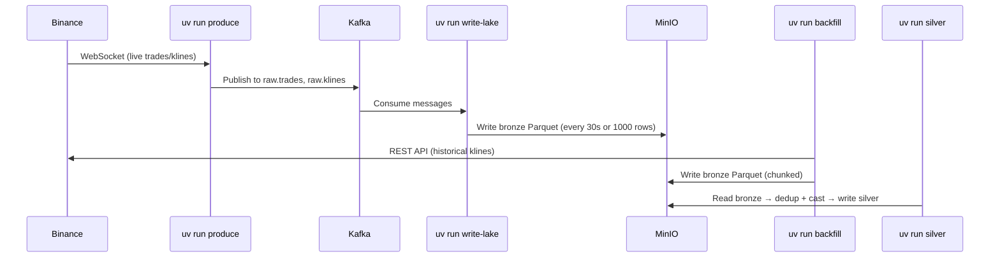

# Quick Start

Get the full pipeline running in 5 minutes.

## Step 1: Start Infrastructure

```bash
docker compose up -d
```

Wait ~15 seconds for Kafka and MinIO to become healthy.

## Step 2: Run the Live Ingestion Pipeline

Start the Binance WebSocket producer (streams live trades and klines to Kafka):

```bash
uv run produce
```

In a separate terminal, start the lake writer (consumes from Kafka, writes Parquet to MinIO):

```bash
uv run write-lake
```

After 30 seconds, you should see log messages indicating Parquet files are being flushed to the `bronze` bucket.

## Step 3: Run the Batch Pipeline

Backfill historical kline data from the Binance REST API:

```bash
uv run backfill
```

Then transform the raw bronze data into a clean, deduplicated silver layer:

```bash
uv run silver
```

## Step 4: Verify

Open the MinIO console at [http://localhost:9001](http://localhost:9001) (login: `minioadmin` / `minioadmin`) and browse the `bronze` and `silver` buckets.

You should see Hive-partitioned Parquet files:

```
bronze/
  trades/symbol=BTCUSDT/year=2026/month=07/day=09/<uuid>.parquet
  klines/symbol=BTCUSDT/interval=1m/year=2026/month=07/day=09/<uuid>.parquet
silver/
  klines/symbol=BTCUSDT/interval=1m/year=2026/month=07/<uuid>.parquet
```

## What Just Happened



## All Commands

| Command | What it does |
|---------|-------------|
| `uv run produce` | Start live Binance WS → Kafka producer |
| `uv run write-lake` | Start Kafka → MinIO bronze writer |
| `uv run backfill` | Backfill historical klines via REST API |
| `uv run silver` | Run PySpark bronze → silver transformation |
| `uv run pytest tests/unit/ -v` | Run unit tests |
| `uv run pytest tests/integration/ -v` | Run integration tests (needs Docker) |
| `uv run pytest tests/e2e/ -v -m e2e` | Run end-to-end tests (needs full stack) |

## Next Steps

- [Configuration Guide](../guides/configuration.md) — Customize symbols, intervals, flush thresholds
- [Running the Pipeline](../guides/running-the-pipeline.md) — Detailed operational guide
- [Architecture](../architecture/overview.md) — Understand the system design
