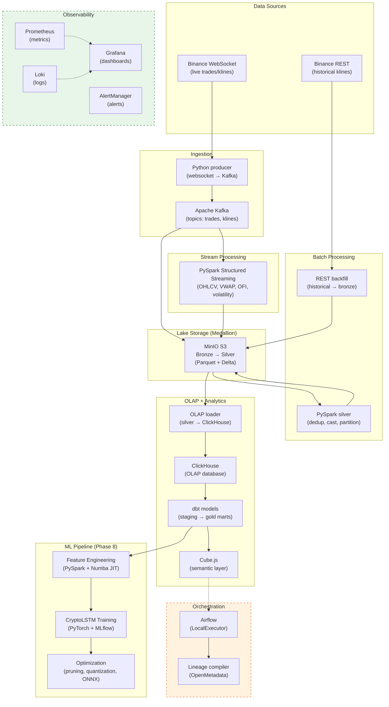

---
hide:
  - navigation
---

# Crypto Platform

**End-to-end crypto market intelligence platform** — live + historical data ingestion, lakehouse storage, OLAP analytics, and ML price-movement prediction.

<div class="grid cards" markdown>

-   :material-rocket-launch-outline:{ .lg .middle } **Getting Started**

    ---

    Get up and running in minutes.

    [:octicons-arrow-right-24: Prerequisites](getting-started/prerequisites.md)

-   :material-sitemap:{ .lg .middle } **Architecture**

    ---

    Understand the system design and data flow.

    [:octicons-arrow-right-24: Overview](architecture/overview.md)

-   :material-console:{ .lg .middle } **Quick Start**

    ---

    Run the full pipeline locally.

    [:octicons-arrow-right-24: Quick Start](getting-started/quickstart.md)

-   :material-road-variant:{ .lg .middle } **Roadmap**

    ---

    10-phase build plan from ingestion to production deploy.

    [:octicons-arrow-right-24: Roadmap](development/roadmap.md)

</div>

## Architecture Overview



## Current Status

| Phase | Name | Status |
|:-----:|------|:------:|
| 1 | Foundation + Ingestion | :material-check-circle:{ style="color: green" } Complete |
| 2 | Batch + Lake Maturation | :material-check-circle:{ style="color: green" } Complete |
| 3 | OLAP + dbt | :material-check-circle:{ style="color: green" } Complete |
| 4 | Stream Processing | :material-check-circle:{ style="color: green" } Complete |
| 5 | Semantic Layer + BI | :material-check-circle:{ style="color: green" } Complete |
| 6 | Orchestration + Governance | :material-check-circle:{ style="color: green" } Complete |
| 7 | Observability | :material-check-circle:{ style="color: green" } Complete |
| 8 | ML Pipeline + Optimization | :material-check-circle:{ style="color: green" } Complete |
| 9 | ML Serving (3-way) | :material-circle-outline: Planned |
| 10 | CI/CD + Deploy + Polish | :material-circle-outline: Planned |

## Quick Install

```bash
git clone https://github.com/yourusername/crypto-platform.git
cd crypto-platform
uv sync
```

[:octicons-arrow-right-24: Full Installation Guide](getting-started/installation.md)

---

**Python 3.13** · **uv** · **Docker** · **Apache Kafka** · **MinIO** · **PySpark** · **ClickHouse** · **dbt** · **Cube.js** · **Airflow**
